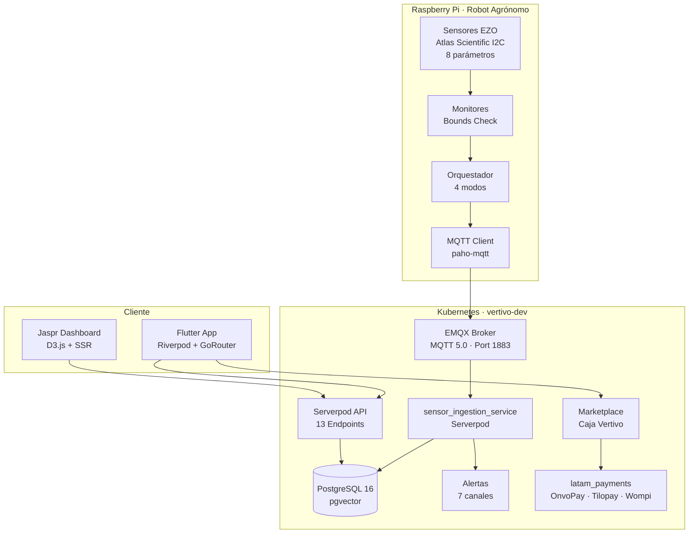

# Vertivo - Micro-Invernaderos Autónomos Aeropónicos con Robot Agrónomo

[](https://kubernetes.io/)
[](https://www.balena.io/)
[](https://flutter.dev/)
[](https://serverpod.dev/)
[](https://www.emqx.io/)

Plataforma cloud-native de **agricultura vertical autónoma por nebuponía** (aeroponía por nebulización) para Latinoamérica. Cada micro-invernadero incluye un **robot agrónomo embebido** (Raspberry Pi + 8 sensores Atlas Scientific EZO) que controla pH, nutrientes, temperatura, humedad y CO2 automáticamente — sin luz solar, sin plagas, sin conocimientos de agronomía. Monitoreo en tiempo real via MQTT, backend Dart/Serverpod, app Flutter y marketplace de insumos.

> **"Una Huerta Pensada para Vos"** — Tu robot agrónomo personal: cultiva tus alimentos en casa sin saber nada de agronomía, sin luz solar, sin plagas, y con insumos en tu puerta cada mes.

## Problema que Resuelve

Los consumidores en Latinoamérica enfrentan **inseguridad alimentaria** y son incapaces de auto-abastecerse de alimentos suficientes, inocuos y libres de pesticidas debido a: falta de espacio urbano, ausencia de conocimientos agronómicos, efectos del cambio climático, cadenas de suministro frágiles, y alto costo del aprendizaje por prueba y error.

| # | Problema | Quién lo sufre | Alternativa actual |
|---|----------|---------------|-------------------|
| 1 | **No pueden verificar que sus alimentos sean realmente libres de pesticidas** — los "orgánicos" del supermercado no son trazables, y cultivar requiere conocimientos, espacio y luz solar | Familias, jubilados, emprendedores wellness | Comprar "orgánico" a ciegas, macetas que mueren en semanas |
| 2 | **Auto-cultivar en zonas urbanas es imposible sin automatización** — sin espacio exterior, clima impredecible, plagas, y aprendizaje carísimo | Techies, influencers, familias urbanas | Kits sin sensores, tutoriales YouTube, jardinería con 12h de foto-período solar |
| 3 | **Las cadenas de suministro de alimentos frescos son frágiles y caras** — precios volátiles (±30%), calidad inconsistente, waste rate >20%, sin trazabilidad regulatoria | Restaurantes, agroindustria, comedores escolares | 6+ proveedores con calidad variable, logística de frío costosa |

## Solución

- **Micro-invernaderos autónomos aeropónicos** con ambiente cerrado (sin plagas), LEDs de horticultura (18h foto-período vs. 12h solar), y robot agrónomo embebido que controla 8 parámetros automáticamente.
- **Nebuponía** (aeroponía por nebulización) — 90% menos agua que agricultura tradicional.
- **Comunicación descentralizada** entre invernaderos del enjambre — cada dispositivo alimenta el cerebro colectivo.
- **App móvil + Dashboard cloud** para monitoreo en tiempo real, alertas push, predicciones, fitopatología AI, reportes de ROI.
- **Marketplace de insumos** con suscripción "Caja Vertivo" donde el robot calcula las necesidades.

## Verticales de Negocio

| Vertical | Modelo | Target |
|----------|--------|--------|
| **Farm Automation** | Venta de hardware + SaaS monitoreo + Insumos marketplace | Familias medio-alto, empresas medianas y grandes |
| **Product-as-a-Service** | Alquiler de hardware + SaaS + Insumos | Familias medio, locales comerciales |
| **Urban-Farming-as-a-Service** | Suscripción de alimentos orgánicos cultivados por Vertivo | Familias bajo ingreso, instituciones sin espacio |

## Segmentos de Usuario

| Segmento | Plan | Hardware |
|----------|------|----------|
| **Residential B2C** | Basic / Pro | Vertivo Home |
| **Commercial B2B** | Commercial | Vertivo Pro |
| **Industrial B2B** | Industrial | Vertivo Scale |
| **Government B2G** | UFaaS / PaaS | Custom |
| **Expert** | Commercial | — |
| **Ecosystem** | Data API | — |

Marketplace adicional: Caja Vertivo (suscripcion mensual de insumos) + on-demand.

## Estado Actual de Implementación

> **Madurez general: ~15%** — Infraestructura y sensores IoT funcionales; las funcionalidades de negocio y la app móvil están en desarrollo temprano.

| Componente | Madurez | Lo que funciona | Gaps principales |
|------------|---------|----------------|-----------------|
| **Serverpod backend** | 40% | 13 endpoints, 30 models, MQTT ingestion | Billing, marketplace, notifications send, referral |
| **Flutter app** | 8% | 2 screens (auth + test), M3 theme | Todas las screens core, GoRouter, Riverpod, FCM |
| **Jaspr dashboard** | 35% | 6 pages, D3.js charts | 100% hardcoded, 0% API connection |
| **Raspberry Pi IoT** | 60% | 8 sensores, 4 orquestadores, MQTT publish | 0 actuadores, 0 robot decision engine |
| **Billing / Pagos** | 0% | — | latam_payments no integrado (revenue = $0) |
| **Marketplace** | 0% | — | Catálogo, carrito, Caja Vertivo |
| **Infraestructura K8s** | 80% | Minikube, EMQX, PostgreSQL, ArgoCD | Producción multi-nodo |

### Lo que funciona hoy

- **IoT completo**: 8 sensores Atlas Scientific EZO leyendo via I2C, monitores con bounds check, MQTT publish a EMQX
- **Simulación realista**: Proceso estocástico Ornstein-Uhlenbeck con 7 escenarios (normal, heat_wave, nutrient_imbalance, sensor_failure, anomaly_spikes, night_cycle, stress)
- **Backend Serverpod**: 13 endpoints funcionales, 30 modelos, MQTT ingestion service, PostgreSQL 16 + pgvector
- **Infraestructura**: Kubernetes (Minikube) + EMQX MQTT 5.0 + PostgreSQL + ArgoCD GitOps

### Lo que se está construyendo (T0 — v0.2.0)

1. **VRTV-5**: Billing — integrar latam_payments (OnvoPay/Tilopay/Wompi). Sin esto, revenue = $0.
2. **VRTV-6**: Flutter — GoRouter + Riverpod + 5 core screens (home, greenhouse list, detail, alerts, profile).
3. **VRTV-7**: Flutter — onboarding wizard (device pairing via QR, primer cultivo).
4. **VRTV-8**: Marketplace MVP — Caja Vertivo tiers, subscribe, checkout. Bloqueado por VRTV-5.

Ver roadmap completo: `srd/gap-audit.md` | [Linear Project](https://linear.app/vertivolatam/project/vertivo-dollar500k-mrr-9b6ce5d7223c)

## Arquitectura del Sistema



### Principios de Diseño

1. **Modularidad** — Cada componente tiene responsabilidad única. Sensores, monitores, orquestadores y servicios backend son independientes.
2. **Extensibilidad** — Agregar un sensor nuevo implica un driver EZO + un monitor. El orquestador lo integra automáticamente.
3. **Resiliencia** — Imports condicionales para hardware (`smbus2`, `tkinter`), reconexión MQTT con backoff exponencial, simulación completa sin I2C.
4. **Configurabilidad** — 4 modos de orquestación, 7 escenarios de simulación, parámetros por variable de entorno o CLI.

## Stack Tecnológico

| Capa | Tecnología |
|------|-----------|
| **Mobile** | Flutter + Riverpod + GoRouter + Serverpod client |
| **Backend** | Dart / Serverpod + PostgreSQL 16 (pgvector) |
| **Dashboard** | Jaspr (Dart SSR) + D3.js + Material Web Components |
| **Broker MQTT** | EMQX Open Source 5.8.6 |
| **IoT** | Raspberry Pi + Python + Atlas Scientific EZO (I2C) + Balena |
| **Pagos** | latam_payments SDK (OnvoPay, Tilopay, Wompi, SPEI, PIX, OXXO) |
| **Infraestructura** | Kubernetes (Minikube) + ArgoCD + Terraform + Podman |
| **Monorepo** | Turborepo v2 + pnpm |
| **Docs** | Zensical / MkDocs Material |
| **Design Tokens** | Style Dictionary |

## Estructura del Monorepo

```
monorepo/
  apps/
    vertivo_server/          # Backend Serverpod (Dart)
    │  lib/src/
    │    ├── auth/            # Autenticación y autorización
    │    ├── users/           # Gestión multi-segmento
    │    ├── greenhouses/     # Micro-invernaderos autónomos
    │    ├── phytopathology/  # Detección de enfermedades con IA
    │    ├── alerts/          # Alertas multi-canal (7 canales)
    │    ├── harvest_prediction/ # Predicciones con ML
    │    ├── traceability/    # Trazabilidad hash-chain
    │    ├── anomaly_management/ # Detección y reporte
    │    ├── crop_catalog/    # Modelos fitotécnicos
    │    ├── management/      # KPIs y dashboards
    │    └── data/data_sources/
    │         ├── mqtt_data_source.dart
    │         └── mqtt_topics.dart
    │  config/
    │    └── development.yaml
    │
    vertivo_client/          # Client stubs generados (Serverpod)
    vertivo_flutter/         # App Flutter (Riverpod + GoRouter)
    widgetbook/              # Widgetbook design system
    raspberry/               # Robot agrónomo (Python)
    │  src/
    │    ├── hardware/sensors/atlas_scientific/
    │    │     ├── AtlasScientificSensor.py  # Base I2C driver
    │    │     ├── EZO_co2_sensor.py
    │    │     ├── EZO_do_sensor.py
    │    │     ├── EZO_ec_sensor.py
    │    │     ├── EZO_humidity_sensor.py
    │    │     ├── EZO_orp_sensor.py
    │    │     ├── EZO_ph_sensor.py
    │    │     ├── EZO_rtd_sensor.py
    │    │     └── EZO_tds_sensor.py
    │    ├── monitors/atlas_scientific/  # 8 monitores con bounds check
    │    ├── orchestrators/              # indoor, outdoor, soil, environmental
    │    ├── simulation/                 # Sensores simulados (Ornstein-Uhlenbeck)
    │    │     ├── simulated_sensors.py  # 8 drop-in replacements
    │    │     ├── scenarios.py          # 7 escenarios predefinidos
    │    │     └── simulator.py          # Motor de simulación
    │    ├── cloud_sdk_libs/             # MQTT clients
    │    └── main.py                     # Entry point con CLI args
    │  tests/
    │
    dashboard/               # Jaspr SSR dashboard (D3.js)
  k8s/
    base/                    # Manifiestos K8s base
    │  postgres/             # PostgreSQL 16 + pgvector
    │  mqtt/                 # EMQX CRD cluster
    │  backend/              # Serverpod deployment
    overlays/dev/            # Overlay desarrollo (Kustomize)
    argocd/                  # GitOps applications
  infrastructure/
    scripts/                 # setup-emqx-operator.sh, bootstrap-raspberry.sh
    terraform/               # IaC
    helm-charts/
    docker/
  srd/                       # SRD framework (estrategia de producto)
  skills/                    # Agent Skills para desarrollo asistido
  docs/                      # Documentación Zensical/MkDocs
    mkdocs.yml
    content/
  style-dictionary/
    tokens.json              # Design tokens (colores, tipografía, motion)
  turbo.json                 # Turborepo pipeline config
  pnpm-workspace.yaml
  Makefile                   # Orquestador principal de comandos
```

## Dominios del Backend

| Dominio | Modelos | Descripción |
|---------|---------|-------------|
| **Auth** | 3 | Autenticación JWT, 2FA para comercial/industrial |
| **Users** | 4 | Gestión multi-segmento (residencial, comercial, industrial, experto) |
| **Greenhouses** | 5 | CRUD de invernaderos, lecturas ambientales, rangos de sensores |
| **Phytopathology** | 4 | Detección de enfermedades con IA, historial de diagnósticos |
| **Alerts** | 4 | Alertas multi-canal diferenciadas por segmento |
| **Harvest Prediction** | 2 | Predicciones ML, scores de calidad nutricional |
| **Traceability** | 3 | Cadena hash-chain, compliance (ISO 22000, SENASA, GlobalGAP) |
| **Anomaly Management** | 1 | Detección AI/sensor/manual/rule_based, clasificación |
| **Crop Catalog** | 2 | Especies, etapas de crecimiento, condiciones ideales |
| **Management** | 1 | KPIs periódicos: yield_rate, health_score, ROI |

## Sensores IoT

8 parámetros monitoreados en tiempo real via Atlas Scientific EZO (I2C):

| Sensor | Parámetro | Unidad | Dirección I2C |
|--------|-----------|--------|---------------|
| EZO CO2 | Dióxido de carbono | ppm | 0x69 |
| EZO HUM | Humedad relativa | % | 0x6F |
| EZO RTD | Temperatura solución | °C | 0x66 |
| EZO pH | Potencial de hidrógeno | — | 0x63 |
| EZO EC | Conductividad eléctrica | uS/cm | 0x64 |
| EZO TDS | Sólidos disueltos totales | mg/L | — |
| EZO DO | Oxígeno disuelto | mg/L | 0x61 |
| EZO ORP | Potencial redox | mV | 0x62 |

### Modos de Orquestación

| Modo | Sensores |
|------|----------|
| `indoor` | CO2, Humedad, DO, EC, ORP, pH, TDS, Temperatura |
| `outdoor` | CO2, Humedad |
| `soil` | EC, pH, Temperatura |
| `environmental` | CO2, Humedad |

### Simulación (sin hardware)

El sistema de simulación usa un proceso estocástico **Ornstein-Uhlenbeck** (mean-reversion) para generar datos realistas. Soporta ciclo diurno, anomalías y fallas simuladas.

Escenarios disponibles: `normal`, `heat_wave`, `nutrient_imbalance`, `sensor_failure`, `anomaly_spikes`, `night_cycle`, `stress`.

## Inicio Rápido

### Prerrequisitos

- Minikube + Podman (o Docker)
- Dart SDK 3.x + Flutter SDK
- Python 3.11+
- pnpm 9+
- kubectl, helm, mosquitto-clients

### Bootstrap completo

```bash
git clone https://github.com/vertivolatam/monorepo.git
cd monorepo
make bootstrap-dev
```

### Levantar infraestructura

```bash
# Todo de una vez: Minikube + PostgreSQL + EMQX + Backend
make dev-all-deploy

# O paso a paso:
make dev-minikube-deploy      # Crear cluster Minikube
make dev-postgres-deploy      # PostgreSQL 16 + pgvector
make dev-emqx-deploy          # EMQX operator + cluster
make dev-backend-deploy       # Serverpod en Kubernetes
```

### Acceder a servicios

```bash
make dev-emqx-dashboard       # EMQX Dashboard → localhost:18083 (admin/public)
make dev-postgres-port-forward # PostgreSQL → localhost:5432
make dev-mqtt-forward          # MQTT → localhost:1883
```

### Ejecutar la app Flutter

```bash
make dev-flutter-start
```

### Simulación IoT (sin Raspberry Pi)

```bash
# Simulación completa: sensores → monitores → MQTT
make dev-raspberry-i2c-sim

# Con escenario específico
SCENARIO=heat_wave make dev-raspberry-i2c-sim

# Listar escenarios
make dev-raspberry-i2c-sim-scenarios

# Test rápido: mosquitto_pub directo a EMQX
make dev-raspberry-emqx-sim
```

### Producción (con hardware)

```bash
make dev-raspberry-start      # Orquestador en modo indoor → EMQX
```

## Comandos Make

```bash
# Infraestructura
make dev-all-deploy            # Desplegar todo
make dev-all-destroy           # Destruir namespace vertivo-dev
make dev-all-status            # Estado de pods y servicios

# Minikube
make dev-minikube-deploy       # Crear cluster
make dev-minikube-destroy      # Eliminar cluster

# PostgreSQL
make dev-postgres-deploy       # Desplegar
make dev-postgres-logs         # Ver logs

# EMQX
make dev-emqx-deploy           # Desplegar broker
make dev-emqx-status           # Estado del cluster
make dev-mqtt-test             # Test de conectividad

# Backend Serverpod
make dev-backend-build         # Build imagen Podman
make dev-backend-deploy        # Desplegar en Minikube
make dev-backend-start         # Modo local (docker-compose DB)
make generate                  # Generar protocolo Serverpod
make migrate                   # Crear migración SQL

# Raspberry Pi / IoT
make dev-raspberry-install     # Instalar deps Python (.venv)
make dev-raspberry-start       # Producción con sensores reales
make dev-raspberry-i2c-sim     # Simulación completa
make dev-raspberry-emqx-sim    # Test MQTT directo
make dev-raspberry-test        # Ejecutar tests
make dev-raspberry-lint        # Lint código Python

# Flutter
make dev-flutter-start         # Ejecutar app
make dev-flutter-build         # Build web

# ArgoCD
make dev-argocd-deploy         # Instalar ArgoCD + apps
make dev-argocd-status         # Estado de aplicaciones

# Turborepo
make build                     # Build todas las apps
make lint                      # Lint todas las apps
make test                      # Test todas las apps

# Documentación
make dev-docs-install          # Instalar Zensical + MkDocs
make dev-docs-serve            # Servir docs con hot-reload
make dev-docs-build            # Build sitio estático
```

## MQTT Topics

Estructura de topics para comunicación sensor → backend:

```
vertivo/{userId}/greenhouse/{greenhouseId}/sensor/{measurementType}
vertivo/{userId}/greenhouse/{greenhouseId}/command/{commandType}
```

Tipos de medición: `co2`, `humidity`, `temperature`, `ph`, `ec`, `tds`, `do`, `orp`.

## Seguridad

- **Autenticación JWT** con políticas diferenciadas por segmento
- **2FA requerido** para segmentos comercial e industrial
- **MQTT sobre TLS** en producción (EMQX soporta mTLS)
- **Rate limiting** por segmento
- **Hash chain** en trazabilidad (SHA-256)
- **latam_payments** con tokenización PCI DSS para pagos LATAM

## Ventaja Competitiva

| Ventaja | Difícil de copiar porque... |
|---------|---------------------------|
| **Enjambre de datos** (network effect) | Cada dispositivo mejora las recetas para todos. Más devices = mejor data = mejores recomendaciones |
| **Robot agrónomo IP** | Algoritmos calibrados con datos de miles de micro-entornos aeropónicos en LATAM |
| **Nebuponía patentable** | Irrigación por nebulización optimizada para micro-invernaderos urbanos |
| **Integración vertical** (hardware + software + insumos) | Competidores ofrecen 1 de 3. Vertivo controla la experiencia completa |
| **LATAM-first** | Pagos locales (SINPE, PSE, SPEI, PIX, OXXO), español nativo, recetas clima tropical |

## Roadmap

| Tier | Semver | Deadline | Foco |
|------|--------|----------|------|
| **T0** | v0.2.0 | Jun 2026 | Billing + App MVP + Marketplace |
| **T1** | v0.3.0 | Ago 2026 | Push, referral, dashboard real, fleet |
| **T2** | v0.4.0 | Nov 2026 | Robot automation, harvest sharing, compliance |
| **T3** | v1.0.0 | Dic 2026+ | Data API, PaaS, UFaaS, digital twins |

**Geo**: CR → PA → CO → MX → BR

Ver detalles en: [`srd/gap-audit.md`](srd/gap-audit.md) | [`srd/success-reality.md`](srd/success-reality.md) | [Linear](https://linear.app/vertivolatam/project/vertivo-dollar500k-mrr-9b6ce5d7223c)

## Estrategia de Producto (SRD)

El framework SRD (Synthetic Reality Development) es la fuente de verdad para priorización:

| Documento | Contenido |
|-----------|-----------|
| [`srd/SRD.md`](srd/SRD.md) | Resumen ejecutivo combinado |
| [`srd/success-reality.md`](srd/success-reality.md) | KPIs, revenue streams, milestones |
| [`srd/business-model-canvas.md`](srd/business-model-canvas.md) | 13 secciones BMC + 10 buyer personas |
| [`srd/journeys.md`](srd/journeys.md) | 8 journeys pantalla por pantalla vs. codebase |
| [`srd/gap-audit.md`](srd/gap-audit.md) | Matriz persona×journey, fix list T0-T3, anti-patterns |
| [`srd/claude-directive.yml`](srd/claude-directive.yml) | Reglas machine-readable para AI agents |

## Socios Clave

| Socio | Producto/Servicio | Importancia |
|-------|-------------------|-------------|
| Atlas Scientific | Sensores EZO I2C | Crítica |
| Raspberry Pi Foundation | SBC robot agrónomo | Crítica |
| OnvoPay / Tilopay | Pagos CR + PA | Crítica |
| Wompi | Pagos CO | Crítica |
| EMQX | MQTT Broker (open source) | Alta |
| Balena | Deployment + OTA updates RPi | Alta |

## Identidad de Marca

- **Razón Social**: Vertivo Horticultura Urbana Vertical S.R.L.
- **Slogan**: "Una Huerta Pensada para Vos"
- **Propósito**: Solventar los problemas de disponibilidad y acceso a alimentos libres de pesticidas, mediante la aeroponía automatizada y el monitoreo remoto.
- **Misión**: Hacer accesible a las personas alimentos de alto valor nutricional y libres de pesticidas, mediante la nebuponía, soluciones nutritivas estandarizadas, automatización de cultivo, y monitoreo remoto del ciclo fenológico.
- **Visión**: Mitigar la emergencia climática cultivando la mayor cantidad posible de huertas urbanas verticales automatizadas, reduciendo la dependencia de tierras de cultivo devastadas.
- **Principios**: Antifragilidad, Rendición de Cuentas, Empatía, Proactividad, Sentido de Urgencia, Curiosidad, Transparencia.
- **ODS**: 12 (Producción Responsable), 11 (Ciudades Sostenibles), 13 (Acción Climática), 8 (Trabajo Decente), 2 (Hambre Cero).

## Documentación

La documentación completa está en `/docs` y se genera con Zensical/MkDocs Material:

```bash
make dev-docs-serve    # Abrir en localhost:8000
```

Secciones: Inicio, Backend (dominios, modelos, endpoints), Mobile (Flutter, Riverpod), IoT (sensores, orquestador, simulación, MQTT), Arquitectura, Despliegue (Kubernetes, ArgoCD), Desarrollo.

## Licencia

Business Source License 1.1. Ver [LICENSE](LICENSE).

---

**Vertivo Horticultura Urbana Vertical S.R.L.** — Cultivando el futuro de la agricultura urbana
