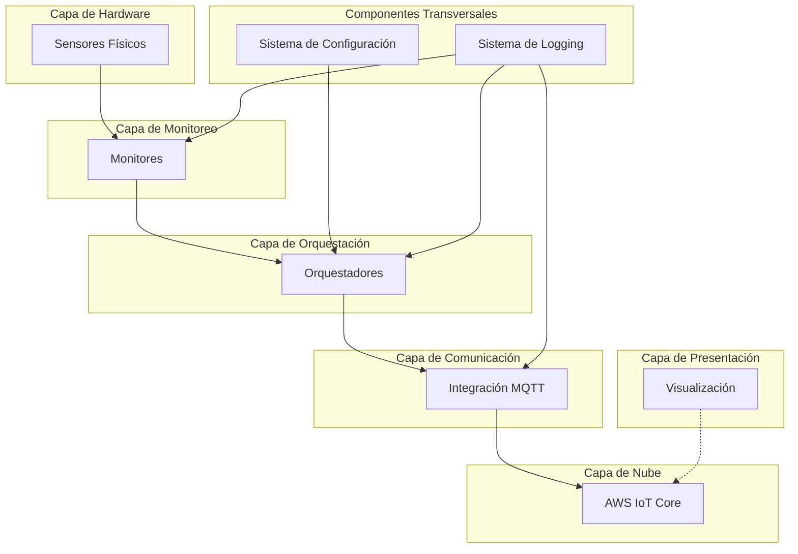

# Orquestador de Monitoreo Python

Orquestador de Monitoreo Agrónomo (para invernaderos autónomos urbanos verticales) y Ambiental (para detección de contaminación ambiental del aire y del agua según diferentes agentes causales) que incorpora diferentes algoritmos y sensores de monitoreo con la capacidad de envío de datos a la nube AWS IoT Core para su posterior análisis en bases de datos de series de tiempo.

Este repositorio contiene un sistema de monitoreo y orquestación para sensores ambientales y agrícolas. El proyecto está organizado en dos partes principales: el código fuente (`src`) y las pruebas unitarias (`tests`).

## Arquitectura del Sistema

El Orquestador de Monitoreo Python sigue una arquitectura modular y por capas, diseñada para ser extensible, resiliente y configurable. La arquitectura está estructurada en las siguientes capas funcionales:

### Diagrama de Arquitectura



### Principios de Diseño

1. **Modularidad**: Cada componente tiene una responsabilidad única y bien definida.
2. **Extensibilidad**: Facilidad para añadir nuevos sensores, monitores y orquestadores.
3. **Resiliencia**: Capacidad para manejar fallos en sensores o conexiones.
4. **Configurabilidad**: Sistema flexible que permite configurar diferentes modos de operación.
5. **Seguridad**: Comunicación segura con AWS IoT Core y manejo adecuado de credenciales.

### Componentes Principales

1. **Monitores**: Interactúan directamente con los sensores físicos y abstraen su complejidad.
2. **Orquestadores**: Coordinan múltiples monitores y aplican lógica específica según el modo de operación.
3. **Integración MQTT**: Gestiona la comunicación con AWS IoT Core mediante el protocolo MQTT.
4. **Sistema de Configuración**: Define y gestiona diferentes modos de operación y parámetros.
5. **Sistema de Logging**: Proporciona registro detallado de errores y eventos.
6. **Visualización**: Utiliza Prometheus y Grafana para monitoreo y visualización de datos.

### Estrategia de Despliegue

El sistema está diseñado para ser desplegado en dispositivos Raspberry Pi utilizando balenaCloud, con una arquitectura de contenedores Docker optimizada para recursos limitados.

## Estructura del Código Fuente (src)

El código fuente del proyecto está organizado en los siguientes módulos principales:

```
src
├───cloud_sdk_libs        # Bibliotecas para integración con servicios en la nube
│   └── aws_iot.py        # Integración con AWS IoT
│
├───hardware              # Controladores de hardware y sensores
│   └───sensors           # Implementaciones de sensores específicos
│       ├───atlas_scientific  # Sensores de Atlas Scientific
│       │   ├── AtlasScientificSensor.py
│       │   ├── EZO_co2_sensor.py
│       │   ├── EZO_do_sensor.py
│       │   ├── EZO_ec_sensor.py
│       │   ├── EZO_humidity_sensor.py
│       │   ├── EZO_orp_sensor.py
│       │   ├── EZO_ph_sensor.py
│       │   ├── EZO_rtd_sensor.py
│       │   └── EZO_tds_sensor.py
│       │
│       └───environmental  # Sensores ambientales
│           ├── AMS_IAQ2000.py
│           ├── Adafruit_ADS1115.py
│           ├── Adafruit_MQ135.py
│           ├── AeroqualSeries200.py
│           ├── Bosch_BME680.py
│           ├── DFRobot_Gravity_TDS.py
│           ├── DFRobot_Gravity_Turbidity.py
│           ├── Figaro_TGS2600.py
│           ├── Honeywell_HPM_Series.py
│           ├── PlantowerPMS5003.py
│           ├── Sensirion_SGP30.py
│           └── resistance_MCP3221.py
│
├───monitors              # Módulos de monitoreo que utilizan los sensores
│   ├───atlas_scientific  # Monitores para sensores Atlas Scientific
│   │   ├── co2_monitor.py
│   │   ├── humidity_monitor.py
│   │   ├── nutrient_solution_do_monitor.py
│   │   ├── nutrient_solution_ec_monitor.py
│   │   ├── nutrient_solution_orp_monitor.py
│   │   ├── nutrient_solution_pH_monitor.py
│   │   ├── nutrient_solution_tds_monitor.py
│   │   └── nutrient_solution_temp_monitor.py
│   │
│   └───environmental     # Monitores para sensores ambientales
│       ├── air_quality.py
│       ├── gases.py
│       ├── oxidation_reduction_potential.py
│       ├── particulate_matter.py
│       └── water_quality.py
│
├───networking            # Módulos para comunicación en red
│   └── local_communication.py
│
├───orchestrators         # Orquestadores que coordinan múltiples monitores
│   ├───agronomic         # Orquestadores para aplicaciones agrícolas
│   │   ├───indoor_urban_vertical_farming
│   │   │   └── orchestrator.py
│   │   │
│   │   ├───outdoor_agricultural_farming
│   │   │   └── orchestrator.py
│   │   │
│   │   └───soil
│   │       └── orchestrator.py
│   │
│   └───environmental     # Orquestadores para aplicaciones ambientales
│       └── orchestrator.py
│
├───utils                 # Utilidades generales
│   ├── error_handling.py
│   └── logger.py
│
└───visualization         # Módulos para visualización de datos
    ├── dashboards.py
    └── plots.py
```
## Estructura del Código Fuente (tests)

La estructura completa de pruebas del proyecto incluye pruebas unitarias para todos los componentes principales:

```
tests
├── __init__.py
│
├───cloud_sdk_libs
│   └── test_aws_iot.py
│
├───hardware
│   └───sensors
│       ├───atlas_scientific
│       │   ├── test_EZO_co2_sensor.py
│       │   ├── test_EZO_do_sensor.py
│       │   ├── test_EZO_ec_sensor.py
│       │   ├── test_EZO_humidity_sensor.py
│       │   ├── test_EZO_orp_sensor.py
│       │   ├── test_EZO_ph_sensor.py
│       │   ├── test_EZO_rtd_temp_sensor.py
│       │   └── test_EZO_tds_sensor.py
│       │
│       └───environmental
│           ├── test_adafruit_ads1115.py
│           ├── test_adafruit_mq135.py
│           ├── test_aeroqual_series200.py
│           ├── test_ams_iaq2000.py
│           ├── test_bosch_bme680.py
│           ├── test_dfrog_gravity_tds.py
│           ├── test_dfrog_gravity_turbidity.py
│           ├── test_figaro_tgs2600.py
│           ├── test_honeywell_hpm_series.py
│           ├── test_plantower_pms5003.py
│           ├── test_resistance_mcp3221.py
│           └── test_sensirion_sgp30.py
│
├───monitors
│   ├───atlas_scientific
│   │   ├── co2_monitor_tests.py
│   │   ├── humidity_monitor_tests.py
│   │   ├── nutrient_solution_do_monitor_tests.py
│   │   ├── nutrient_solution_ec_monitor_tests.py
│   │   ├── nutrient_solution_orp_monitor_tests.py
│   │   ├── nutrient_solution_pH_monitor_tests.py
│   │   ├── nutrient_solution_tds_monitor_tests.py
│   │   └── nutrient_solution_temp_monitor_tests.py
│   │
│   └───environmental
│       ├── air_quality_tests.py
│       ├── gases_tests.py
│       ├── oxidation_reduction_potential_tests.py
│       ├── particulate_matter_tests.py
│       └── water_quality_tests.py
│
├───networking
│   └── test_local_communication.py
│
├───orchestrators
│   ├───agronomic
│   │   ├── test_indoor_urban_vertical_farming.py
│   │   ├── test_outdoor_agricultural_farming.py
│   │   ├── test_soil.py
│   │   └── test_initial_state.json
│   │
│   └───environmental
│       └── test_orchestrator.py
│
└───utils
    ├── test_error_handling.py
    └── test_logger.py
```

## Relación entre Código Fuente y Pruebas

La estructura de pruebas está diseñada para reflejar la organización del código fuente, facilitando la correspondencia entre los módulos y sus pruebas. Cada archivo de prueba está destinado a verificar la funcionalidad de su módulo correspondiente en el código fuente.

Por ejemplo:
- `tests/monitors/atlas_scientific/co2_monitor_tests.py` contiene pruebas para `src/monitors/atlas_scientific/co2_monitor.py`
- `tests/monitors/environmental/air_quality_tests.py` contiene pruebas para `src/monitors/environmental/air_quality.py`

## Dependencias del Proyecto

El archivo `requirements.txt` contiene todas las dependencias necesarias para ejecutar el proyecto. A continuación se describe el propósito de cada biblioteca:

### Bibliotecas para Sensores Adafruit
- **adafruit-ads1x15**: Controlador para el conversor analógico-digital ADS1x15, utilizado para leer sensores analógicos.
- **adafruit-circuitpython-ads1x15**: Versión CircuitPython del controlador ADS1x15, con API mejorada.
- **adafruit-circuitpython-bme680**: Controlador para el sensor ambiental BME680 (temperatura, humedad, presión y gases).
- **adafruit-circuitpython-mcp230xx**: Controlador para expansores de E/S digitales MCP230xx.
- **adafruit-circuitpython-sgp30**: Controlador para el sensor de calidad del aire SGP30 (VOC y CO2eq).
- **adafruit-circuitpython-pm25**: Controlador para sensores de partículas PM2.5.
- **adafruit-circuitpython-scd30**: Controlador para el sensor de CO2, temperatura y humedad SCD30.

### Bibliotecas para Sensores Atlas Scientific
- **atlas-scientific-i2c**: Controlador para sensores Atlas Scientific que utilizan el protocolo I2C.

### Comunicación con AWS
- **awsiotsdk**: SDK oficial de AWS IoT para la comunicación con AWS IoT Core.

### Comunicación MQTT
- **paho-mqtt**: Cliente MQTT ligero y flexible, alternativo al SDK de AWS IoT.

### Visualización de Datos
- **matplotlib**: Biblioteca para la creación de gráficos estáticos, animados e interactivos.
- **seaborn**: Biblioteca de visualización estadística basada en matplotlib.
- **grafanalib**: Biblioteca para crear dashboards de Grafana programáticamente.

### Análisis de Datos
- **numpy**: Biblioteca fundamental para computación científica en Python.
- **pandas**: Biblioteca para manipulación y análisis de datos estructurados.

### Comunicación con Hardware
- **pyserial**: Biblioteca para acceder a puertos serie.
- **smbus2**: Biblioteca para comunicación con dispositivos I2C.

### Documentación
- **sphinx**: Generador de documentación.
- **sphinx-autobuild**: Herramienta para reconstruir automáticamente la documentación cuando cambia.
- **sphinx-rtd-theme**: Tema "Read the Docs" para Sphinx.
- **myst-parser**: Parser de Markdown para Sphinx.

### Monitoreo y Métricas
- **prometheus-client**: Cliente para exportar métricas a Prometheus.

### Bases de Datos
- **sqlalchemy**: ORM (Object-Relational Mapping) para trabajar con bases de datos SQL.
- **sqlite3**: Biblioteca para trabajar con bases de datos SQLite.

### Logging y Configuración
- **python-json-logger**: Formateador de logs en formato JSON.
- **pyyaml**: Parser y emisor de YAML para Python.

### Pruebas
- **pytest**: Framework para escribir pruebas pequeñas y legibles.
- **pytest-mock**: Plugin de pytest para crear mocks en pruebas.

### Utilidades
- **python-dotenv**: Carga variables de entorno desde archivos .env.
- **requests**: Biblioteca HTTP para Python.
- **schedule**: Biblioteca para programar tareas periódicas.