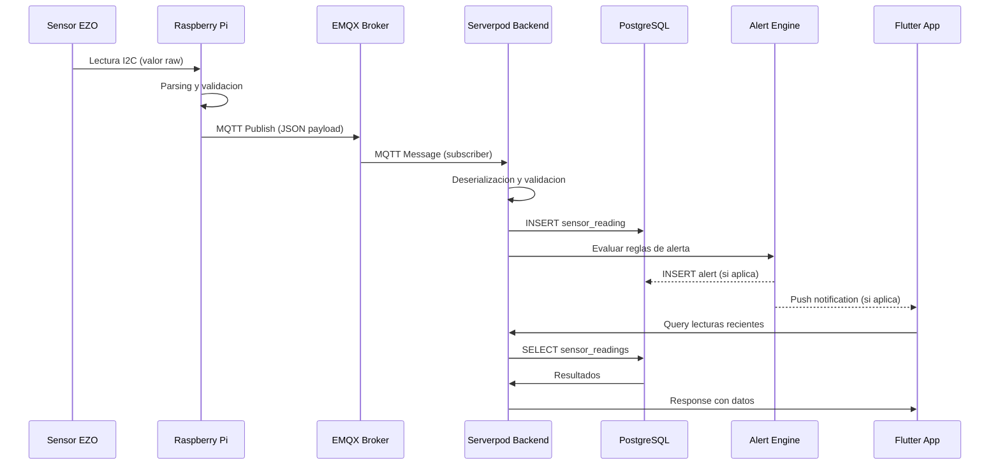

# Flujo de Datos

Esta pagina documenta el recorrido completo de una lectura de sensor desde el momento en que se toma en el Raspberry Pi hasta que se persiste en PostgreSQL y potencialmente dispara una alerta.

## Diagrama de flujo

## Etapas del flujo

### 1. Lectura del sensor

El orchestrator del Raspberry Pi lee el sensor Atlas EZO via I2C. El valor raw se parsea segun el tipo de sensor y se valida contra rangos esperados.

### 2. Publicacion MQTT

El Raspberry Pi serializa la lectura en un payload JSON y la publica al topic correspondiente en EMQX: `vertivo/{userId}/greenhouse/{ghId}/sensor/{type}`.

### 3. Ingesta en el backend

El servicio `sensor_ingestion_service.dart` de Serverpod recibe el mensaje MQTT, lo deserializa, valida la integridad del payload y lo persiste como un registro en la tabla `sensor_readings` de PostgreSQL.

### 4. Evaluacion de alertas

Inmediatamente despues de persistir la lectura, el motor de alertas evalua las reglas configuradas por el usuario. Si algun valor excede los umbrales definidos, se genera una alerta y se envia una notificacion push a la app movil.

### 5. Consulta desde la app

La app Flutter consulta las lecturas recientes via RPC al backend. Los dashboards se actualizan en tiempo real mostrando graficas, indicadores y el estado de cada sensor.
