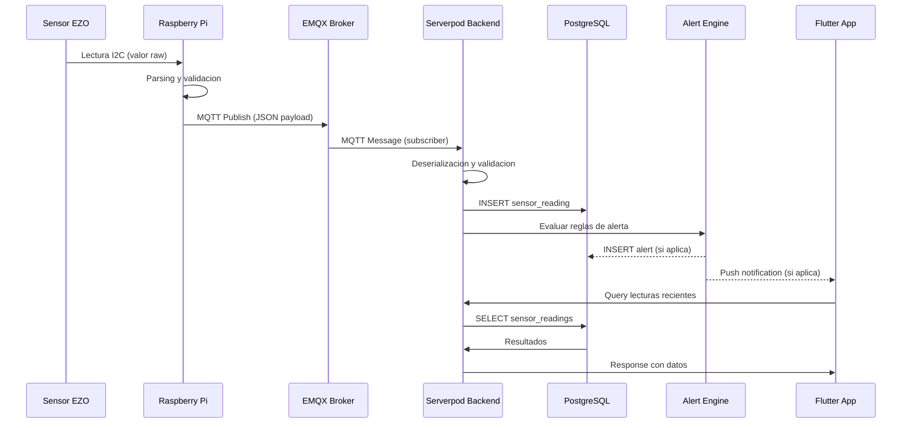

# Flujo de Datos

Esta pagina documenta el recorrido completo de una lectura de sensor desde el momento en que se toma en el Raspberry Pi hasta que se persiste en PostgreSQL y potencialmente dispara una alerta.

## Diagrama de flujo


```mermaid
sequenceDiagram
    participant S as Sensor EZO
    participant R as Raspberry Pi
    participant E as EMQX Broker
    participant B as Serverpod Backend
    participant DB as PostgreSQL
    participant AL as Alert Engine
    participant APP as Flutter App

    S->>R: Lectura I2C (valor raw)
    R->>R: Parsing y validacion
    R->>E: MQTT Publish (JSON payload)
    E->>B: MQTT Message (subscriber)
    B->>B: Deserializacion y validacion
    B->>DB: INSERT sensor_reading
    B->>AL: Evaluar reglas de alerta
    AL-->>DB: INSERT alert (si aplica)
    AL-->>APP: Push notification (si aplica)
    APP->>B: Query lecturas recientes
    B->>DB: SELECT sensor_readings
    DB->>B: Resultados
    B->>APP: Response con datos
```

## Etapas del flujo

### 1. Lectura del sensor

El orchestrator del Raspberry Pi lee el sensor Atlas EZO via I2C. El valor raw se parsea segun el tipo de sensor y se valida contra rangos esperados.

### Contrato de payload MQTT (SSOT)

> Fuente de verdad implementada en `apps/raspberry/src/networking/mqtt.py::_sensor_payload`
> (verificado en el broker el 2026-09-20). Solo `sensor/*` se persiste en Postgres;
> la ingesta ignora `/telemetry` y `/status`.

### Topic

```text
vertivo/{userId}/greenhouse/{greenhouseId}/sensor/{measurementType}
vertivo/{userId}/greenhouse/{greenhouseId}/telemetry   # agregado, NO se persiste
vertivo/{userId}/greenhouse/{greenhouseId}/status      # presencia, NO se persiste
```

### Schema por lectura

```jsonc
{
  "value": 22.59,          // f64, lectura parseada del EZO
  "unit": "C",             // ver tabla de unidades
  "sensorId": "<deviceId>/<metric>",  // ej. "rpi-01/nutrient_temperature"
  "timestamp": 1789964162.4  // epoch segundos (f64)
}
```

### Unidades por métrica

| Topic `sensor/*` | Unidad | Origen |
|---|---|---|
| `temperature` | `C` | Duplica el RTD (sin sensor de aire dedicado en el sim) |
| `humidity` | `%` | EZO-HUM `0x6F` |
| `co2` | `ppm` | EZO-CO2 `0x69` |
| `nutrient_temperature` | `C` | EZO-RTD `0x66` |
| `ph` | `pH` | EZO-pH `0x63` (slot aislado) |
| `ec` | `uS/cm` | EZO-EC `0x64` (slot aislado) |
| `tds` | `mg/L` | Derivado de EC |
| `do` | `mg/L` | EZO-DO `0x61` (slot aislado) |
| `orp` | `mV` | EZO-ORP `0x62` (slot aislado) |

Ritmo: cada métrica en su topic cada ~5s (`--sim-interval 5`).

## 2. Publicacion MQTT

El Raspberry Pi serializa la lectura en un payload JSON y la publica al topic correspondiente en EMQX: `vertivo/{userId}/greenhouse/{ghId}/sensor/{type}`.

### 3. Ingesta en el backend

El servicio `sensor_ingestion_service.dart` de Serverpod recibe el mensaje MQTT, lo deserializa, valida la integridad del payload y lo persiste como un registro en la tabla `sensor_readings` de PostgreSQL.

### 4. Evaluacion de alertas

Inmediatamente despues de persistir la lectura, el motor de alertas evalua las reglas configuradas por el usuario. Si algun valor excede los umbrales definidos, se genera una alerta y se envia una notificacion push a la app movil.

### 5. Consulta desde la app

La app Flutter consulta las lecturas recientes via RPC al backend. Los dashboards se actualizan en tiempo real mostrando graficas, indicadores y el estado de cada sensor.
