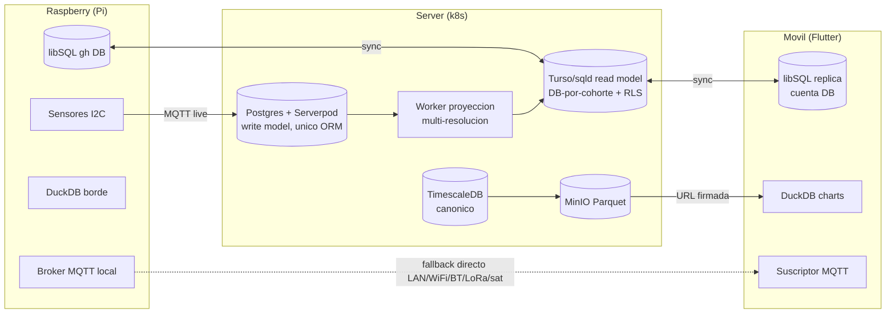

# Arquitectura de datos multi-nodo (tri-nodo fractal)

!!! info "Documento de referencia y fuente de verdad"
    Esta pagina es un **overview**. El documento de referencia completo vive en
    `docs/architecture/data-architecture.md` y las **decisiones canonicas** (PDR + ADR-1..6 + tasks)
    viven en el OpenSpec change `2026-06-25-multinode-data-architecture`. Ante cualquier discrepancia,
    **gana el OpenSpec**.

Los tres nodos de Vertivo (server, Raspberry, movil) corren **la misma pareja de motores** — **libSQL/Turso**
(OLTP + sync) y **DuckDB** (OLAP + Parquet) — con roles y escala distintos pero **contratos identicos**. El
server suma **TimescaleDB** como backbone canonico del historico grande.

## Tres clases de dato, cada una por su canal

1. **OLTP operativo/config** (config del orquestador, alertas, outbox) → **libSQL/Turso** replica embebida
   (sync de frames binarios, offline-first).
2. **Telemetria live** → **MQTT** (el movil es suscriptor; fuente = EMQX cloud o broker local del Pi). Buffer
   `recent_readings` local-only, ventana 7d parametrizable. **No paga writes de Turso.**
3. **Historico OLAP** → **Parquet/rollups** (Timescale o Pi) → **DuckDB** on-device para los charts
   Grafana-style.

## Diagrama tri-nodo

## Otras decisiones de diseno

- **CQRS con un solo ORM, sin GraphQL** — Postgres/Serverpod = write model; libSQL = read model proyectado por
  un worker delgado. El query flexible se mudo a DuckDB on-device.
- **Tenancy multi-resolucion por rol de nodo** — DB-por-invernadero (Pi) ⊂ DB-por-cuenta (movil) ⊂
  DB-por-cohorte+RLS (server).
- **Device-shadow con provenance** — `policy` con estados `desired`/`reported`/`override`; el provenance es
  trazabilidad + gate de seguridad + evidencia de garantia anti-fraude.
- **Ladder de transportes** — WiFi/LAN → celular → Bluetooth → Zigbee → LoRa/Meshtastic → satelite; el tier
  decide la clase de dato.

## Referencias

- Referencia completa: `docs/architecture/data-architecture.md`
- Decision canonica (SSOT): `openspec/changes/2026-06-25-multinode-data-architecture/`
- Consolidacion de config (Fase Pre-0): `openspec/changes/2026-06-25-config-setpoint-canonicalization/` +
  `docs/repo-health/SCH-audit-2026-06-25.md`
- TimescaleDB (Fase 1): `openspec/changes/2026-06-21-timescaledb-timeseries/`
