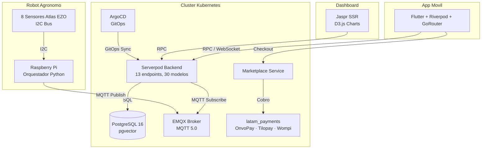

# Arquitectura del Sistema

Vertivo es una plataforma de **agricultura vertical autonoma por nebuponia** compuesta por cuatro pilares: una **app movil Flutter**, un **backend Serverpod**, **dispositivos IoT Raspberry Pi** (robot agronomo) y un **marketplace de insumos**. Todos los servicios de infraestructura corren en un cluster Kubernetes.

## Diagrama de arquitectura

## Flujo principal

1. Los **sensores Atlas Scientific EZO** leen 8 variables ambientales y de solucion nutritiva via bus I2C.
2. El **Raspberry Pi** (robot agronomo) publica las lecturas al broker **EMQX** mediante MQTT.
3. **Serverpod** se suscribe a los topics MQTT, procesa los datos y los persiste en **PostgreSQL**.
4. La **app Flutter** consulta los datos via RPC al backend y muestra dashboards en tiempo real.
5. El **marketplace** permite comprar insumos via **latam_payments** (OnvoPay/Tilopay/Wompi).
6. **ArgoCD** mantiene los despliegues sincronizados con el repositorio Git.
7. **Balena** gestiona OTA updates de los dispositivos Raspberry Pi en campo.

## Principios de diseno

| Principio | Descripcion |
|-----------|-------------|
| **Monorepo** | Todo el codigo vive en un solo repositorio gestionado con Turborepo y pnpm |
| **GitOps** | La infraestructura se define como codigo y se despliega con ArgoCD |
| **Type-safety** | Dart end-to-end desde backend hasta app movil gracias a Serverpod |
| **Offline-first** | La app movil funciona con conectividad intermitente |
| **Modularidad** | Sensores, monitores, orquestadores y servicios backend son independientes |
| **Resiliencia** | Imports condicionales, reconexion MQTT con backoff, simulacion sin hardware |
| **LATAM-first** | Pagos locales, espanol nativo, recetas para clima tropical |

## Capas del sistema

| Capa | Tecnologia | Funcion |
|------|-----------|---------|
| **Presentacion** | Flutter + Riverpod + Jaspr SSR | UI movil y dashboard web |
| **API** | Serverpod (Dart) | Endpoints RPC, autenticacion, logica de negocio |
| **Mensajeria** | EMQX (MQTT 5.0) | Comunicacion IoT bidireccional |
| **Persistencia** | PostgreSQL 16 + pgvector | Datos de sensores, usuarios, invernaderos |
| **IoT** | Python + Atlas Scientific | Robot agronomo, sensores, monitores |
| **Pagos** | latam_payments SDK | Billing, suscripciones, marketplace |
| **Infra** | Kubernetes + ArgoCD + Balena | Orquestacion cloud + fleet management IoT |

## Siguientes secciones

- [Tecnologias](technologies.md) — Detalle del stack completo
- [Flujo de datos](data-flow.md) — Secuencia sensor → MQTT → backend → DB → app
