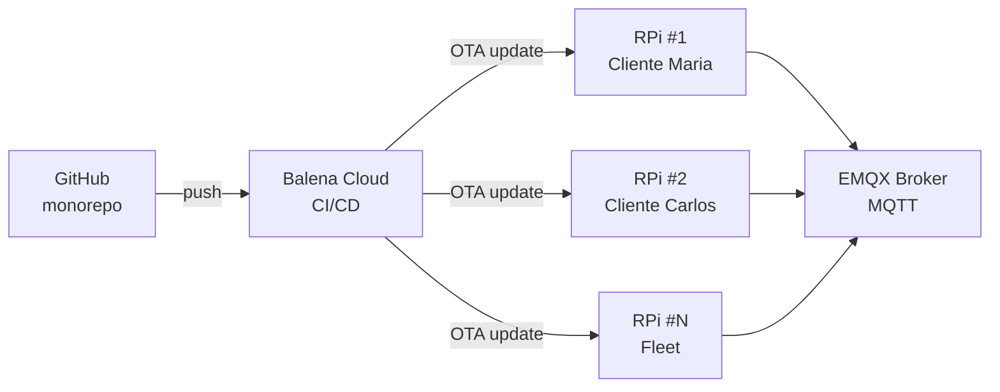

# Balena — Deployment Raspberry Pi

Vertivo utiliza **Balena** para gestionar el deployment del software del robot agronomo a los dispositivos Raspberry Pi en campo. Balena proporciona OTA (Over-The-Air) updates, fleet management y monitoreo remoto.

## Arquitectura de Deployment



## Estructura del Proyecto Balena

El directorio `apps/raspberry/` contiene la configuracion de Balena:

```
apps/raspberry/
  Dockerfile.template    # Multi-arch build (armv7, aarch64)
  docker-compose.yml     # Servicio principal del orquestador
  balena.yml             # Metadata del proyecto Balena
  src/                   # Codigo fuente Python
  requirements.txt       # Dependencias Python
```

## Fleet Management

Balena permite gestionar todos los dispositivos Raspberry Pi desde un solo dashboard:

| Capacidad | Descripcion |
|-----------|-------------|
| **OTA Updates** | Push de nuevas versiones del orquestador sin acceso fisico |
| **Device Variables** | Configuracion por dispositivo (modo, intervalo, MQTT broker URL) |
| **Logs remotos** | Acceso a logs en tiempo real de cada dispositivo |
| **SSH remoto** | Terminal remoto para debugging |
| **Health checks** | Monitoreo de estado y reinicio automatico |

## Variables de Entorno

| Variable | Descripcion | Default |
|----------|-------------|---------|
| `ORCHESTRATOR_MODE` | Modo de orquestacion | `indoor` |
| `MQTT_BROKER_HOST` | Host del broker EMQX | — |
| `MQTT_BROKER_PORT` | Puerto del broker | `1883` |
| `MQTT_USER_ID` | UUID del usuario propietario | — |
| `MQTT_GREENHOUSE_ID` | ID del greenhouse | — |
| `READ_INTERVAL` | Segundos entre lecturas | `30` |
| `SIMULATE` | Activar modo simulacion | `false` |

## Bootstrap de un Nuevo Dispositivo

```bash
# 1. Flashear imagen Balena en SD card
balena os download raspberrypi4-64 -o vertivo-rpi.img
balena os configure vertivo-rpi.img --fleet vertivo/robot-agronomo

# 2. Insertar SD card en Raspberry Pi y encender
# El dispositivo se registra automaticamente en Balena Cloud

# 3. Configurar variables de entorno desde el dashboard o CLI
balena env add MQTT_BROKER_HOST mqtt.vertivo.com --device <uuid>
balena env add MQTT_USER_ID <user-uuid> --device <uuid>
balena env add MQTT_GREENHOUSE_ID <gh-uuid> --device <uuid>
```

## Actualizaciones

Cada push a la rama `main` del monorepo que modifique `apps/raspberry/` dispara un build automatico en Balena Cloud. Los dispositivos en campo reciben la nueva version automaticamente (rolling update con rollback en caso de falla).
