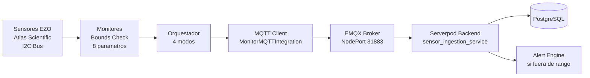

# IoT — Robot Agronomo

El sistema IoT de Vertivo corre en **Raspberry Pi** y constituye el **robot agronomo embebido** de cada micro-invernadero. Gestiona 8 sensores Atlas Scientific EZO conectados via I2C, publica las lecturas a EMQX via MQTT, y ejecuta monitores con bounds check para alertas.

## 8 Parametros Monitoreados en Tiempo Real

- **Ambientales**: CO2 (ppm), Humedad (%), Temperatura (°C)
- **Solucion nutritiva**: pH, EC (uS/cm), TDS (mg/L), DO (mg/L), ORP (mV)

| Sensor | Parametro | Unidad | Direccion I2C |
|--------|-----------|--------|---------------|
| EZO CO2 | Dioxido de carbono | ppm | 0x69 |
| EZO HUM | Humedad relativa | % | 0x6F |
| EZO RTD | Temperatura solucion | °C | 0x66 |
| EZO pH | Potencial de hidrogeno | — | 0x63 |
| EZO EC | Conductividad electrica | uS/cm | 0x64 |
| EZO TDS | Solidos disueltos totales | mg/L | — |
| EZO DO | Oxigeno disuelto | mg/L | 0x61 |
| EZO ORP | Potencial redox | mV | 0x62 |

> TDS se calcula a partir de la lectura de EC con un factor de conversion configurable.

## Arquitectura del Pipeline



## Modos de Orquestacion

| Modo | Sensores | Uso |
|------|----------|-----|
| `indoor` | CO2, Humedad, DO, EC, ORP, pH, TDS, Temperatura | Micro-invernadero aeroponico interior |
| `outdoor` | CO2, Humedad | Agricultura exterior |
| `soil` | EC, pH, Temperatura | Monitoreo de suelo |
| `environmental` | CO2, Humedad | Monitoreo ambiental general |

## Estructura del Proyecto

```
apps/raspberry/
  src/
    hardware/sensors/atlas_scientific/
      ├── AtlasScientificSensor.py  # Clase base I2C
      ├── EZO_co2_sensor.py         # CO2 driver
      ├── EZO_do_sensor.py          # Oxigeno disuelto
      ├── EZO_ec_sensor.py          # Conductividad electrica
      ├── EZO_humidity_sensor.py    # Humedad relativa
      ├── EZO_orp_sensor.py         # Potencial redox
      ├── EZO_ph_sensor.py          # pH
      ├── EZO_rtd_sensor.py         # Temperatura
      └── EZO_tds_sensor.py         # Solidos disueltos
    monitors/atlas_scientific/       # 8 monitores con bounds check
    orchestrators/                   # indoor, outdoor, soil, environmental
    simulation/                      # Sensores simulados (Ornstein-Uhlenbeck)
      ├── simulated_sensors.py       # 8 drop-in replacements
      ├── scenarios.py               # 7 escenarios predefinidos
      └── simulator.py               # Motor de simulacion
    cloud_sdk_libs/                  # MQTT clients
    main.py                          # Entry point con CLI args
  tests/                             # pytest
  requirements.txt
  Dockerfile.template                # Multi-arch build para Balena
```

## Ejecucion

```bash
# Produccion (con sensores reales via Balena)
make dev-raspberry-start

# Simulacion completa (sin I2C)
make dev-raspberry-i2c-sim

# Simulacion con escenario especifico
SCENARIO=heat_wave make dev-raspberry-i2c-sim

# Listar escenarios disponibles
make dev-raspberry-i2c-sim-scenarios

# Test MQTT directo a EMQX
make dev-raspberry-emqx-sim
```

## Deployment

Los dispositivos en campo se gestionan via **Balena** con OTA updates. Ver [Balena deployment](../deployment/balena.md).

## Gaps actuales (SRD)

!!! warning "Sensor-rich, action-poor"
    El sistema lee 8 sensores pero no controla 0 actuadores. La automatizacion del robot agronomo (bombas, valvulas, LEDs) es VRTV-18, planificada para T2 (v0.4.0).

## Secciones

- [Sensores Atlas Scientific](sensors.md) — Detalle de los 8 sensores EZO y bus I2C
- [Orquestador](orchestrator.md) — IndoorUrbanVerticalFarmingOrchestrator y threading
- [Simulacion](simulation.md) — Proceso Ornstein-Uhlenbeck y 7 escenarios
- [MQTT Topics](mqtt-topics.md) — Estructura de topics y formato de payload
