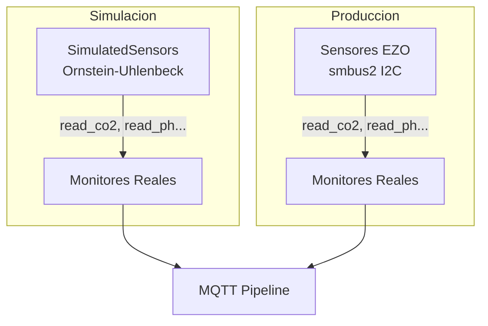

# Simulacion de Sensores

El sistema de simulacion permite ejecutar el pipeline completo **sin hardware I2C conectado**. Reemplaza los sensores reales con generadores de datos sinteticos que implementan la misma interfaz `read_*()`.

## Como Funciona



Los sensores simulados se inyectan via el patron de dependency injection existente:

```python
# El monitor acepta sensor opcional
CO2Monitor(lower, upper, input_EZO_CO2Sensor=SimulatedCO2Sensor())
```

## Modelo de Datos: Ornstein-Uhlenbeck

Cada sensor simulado usa un proceso estocastico de **mean reversion** que genera datos realistas:

- **Media**: valor objetivo alrededor del cual fluctua
- **Desviacion estandar**: magnitud del ruido
- **Tasa de reversion**: que tan rapido vuelve a la media (0-1)
- **Ciclo diurno**: sinusoide de 24h (opcional)
- **Anomalias**: spikes aleatorios (probabilidad configurable)
- **Fallas**: retorna NaN simulando desconexion (probabilidad configurable)

## Escenarios Disponibles

| Escenario | Descripcion |
|-----------|-------------|
| `normal` | Operacion normal con fluctuaciones naturales |
| `heat_wave` | Temperatura alta, humedad baja, estres de oxigeno |
| `nutrient_imbalance` | pH y EC fuera de rango, degradacion de nutrientes |
| `sensor_failure` | Lecturas NaN aleatorias simulando fallas hardware |
| `anomaly_spikes` | Spikes extremos ocasionales en multiples sensores |
| `night_cycle` | Condiciones nocturnas: CO2 alto, humedad alta, temp baja |
| `stress` | Todos los parametros cerca de sus limites |

## Uso

```bash
# Listar escenarios
make dev-raspberry-i2c-sim-scenarios

# Ejecutar simulacion normal
make dev-raspberry-i2c-sim

# Escenario especifico con intervalo custom
SCENARIO=heat_wave INTERVAL=10 make dev-raspberry-i2c-sim

# Via Python directo
cd apps/raspberry
.venv/bin/python3 -m src.main \
    --orchestrator-mode indoor \
    --simulate \
    --scenario nutrient_imbalance \
    --sim-interval 15 \
    --debug
```

## Salida de Ejemplo

```
======================================================================
  SIMULATION [heat_wave]  --  14:23:15
======================================================================
  CO2:                                  537.91 ppm
  Humedad:                               38.22 %
  Temperatura (solucion):                30.46 C
  pH:                                     6.26
  EC:                                  1800.18 uS/cm
  TDS:                                 1206.68 mg/L
  DO:                                     4.54 mg/L
  ORP:                                  366.14 mV

  ALERTS:
  !! Humidity below lower bound (40)
======================================================================
```
