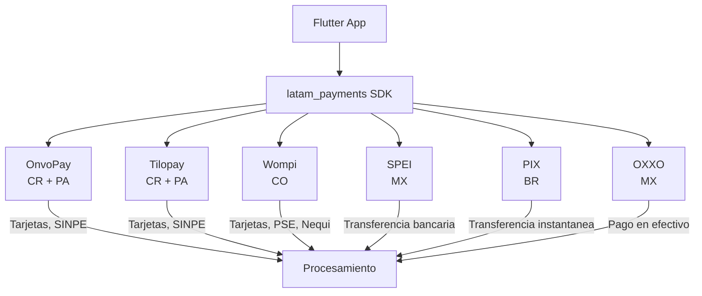

# latam_payments SDK

Vertivo utiliza el SDK `latam_payments` para procesar todos los pagos de la plataforma. Este SDK abstrae multiples pasarelas de pago latinoamericanas detras de una interfaz unificada.

!!! danger "Prioridad #1 del Roadmap"
    Sin billing integrado, revenue = $0. La integracion de latam_payments (VRTV-5) es el bloqueante absoluto de T0.

## Arquitectura



## Pasarelas por Pais

| Pais | Pasarela | Metodos de Pago | Estado |
|------|----------|----------------|--------|
| **Costa Rica** | OnvoPay, Tilopay | Tarjetas (Visa/MC/AMEX), SINPE Movil | Prioritario (T0) |
| **Panama** | OnvoPay, Tilopay | Tarjetas, ACH | Prioritario (T0) |
| **Colombia** | Wompi | Tarjetas, PSE, Nequi, Bancolombia | T0 |
| **Mexico** | SPEI, OXXO | Transferencia bancaria, pago en efectivo | T1 |
| **Brasil** | PIX | Transferencia instantanea | T1 |

## Flujos de Pago

### Suscripcion SaaS

```
Usuario → Selecciona plan → Ingresa metodo de pago → latam_payments.createSubscription()
→ Pasarela cobra → Webhook confirma → Backend activa plan → App refleja upgrade
```

### Compra de Hardware

```
Usuario → Agrega Vertivo Home al carrito → Checkout → latam_payments.createPayment()
→ Pasarela cobra → Webhook confirma → Backend crea orden → Fulfillment envia
```

### Caja Vertivo (Marketplace)

```
Robot calcula necesidades → Sugiere Caja → Usuario confirma → latam_payments.createSubscription()
→ Cobro mensual automatico → Fulfillment prepara caja → Logistica last-mile entrega
```

## Interfaz del SDK

```dart
// Patron Adapter — cambio de proveedor sin impacto
abstract class PaymentGateway {
  Future<PaymentResult> createPayment(PaymentRequest request);
  Future<SubscriptionResult> createSubscription(SubscriptionRequest request);
  Future<void> cancelSubscription(String subscriptionId);
  Future<PaymentStatus> getPaymentStatus(String paymentId);
}

// Implementaciones por pasarela
class OnvoPayGateway implements PaymentGateway { ... }
class TilopayGateway implements PaymentGateway { ... }
class WompiGateway implements PaymentGateway { ... }
```

## Guardrails

!!! warning "latam_payments Only"
    No integrar Stripe ni PayPal como pasarela primaria. Usar exclusivamente el SDK latam_payments con pasarelas locales. Esto es un guardrail del SRD.

## Referencia

El SDK de referencia esta en: `altrupets-monorepo/apps/mobile/lib/core/payments/latam_payments.dart`

---

> Issue: [VRTV-5](https://linear.app/vertivolatam/issue/VRTV-5) | Tier: T0 | Estimacion: 8 pts
