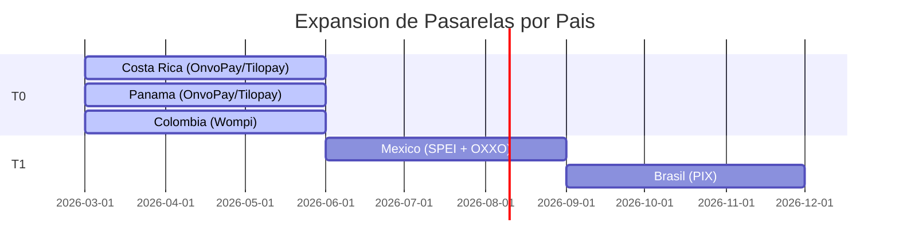

# Pasarelas de Pago LATAM

Vertivo es **LATAM-first**: los pagos se procesan con pasarelas locales que soportan los metodos preferidos por cada mercado. No se usa Stripe ni PayPal como primario.

## OnvoPay (Costa Rica + Panama)

| Caracteristica | Detalle |
|---------------|---------|
| **Paises** | Costa Rica, Panama |
| **Metodos** | Visa, Mastercard, AMEX, SINPE Movil |
| **Tokenizacion** | Si (PCI DSS compliant) |
| **Suscripciones** | Si (cobro recurrente automatico) |
| **Webhooks** | Si |
| **Monedas** | CRC, USD |

## Tilopay (Costa Rica + Panama)

| Caracteristica | Detalle |
|---------------|---------|
| **Paises** | Costa Rica, Panama |
| **Metodos** | Visa, Mastercard, SINPE Movil |
| **Tokenizacion** | Si |
| **Suscripciones** | Si |
| **Webhooks** | Si |
| **Monedas** | CRC, USD |

## Wompi (Colombia)

| Caracteristica | Detalle |
|---------------|---------|
| **Paises** | Colombia |
| **Metodos** | Visa, Mastercard, PSE (debito bancario), Nequi, Bancolombia |
| **Tokenizacion** | Si |
| **Suscripciones** | Si |
| **Webhooks** | Si |
| **Monedas** | COP |

## SPEI (Mexico — Fase T1)

| Caracteristica | Detalle |
|---------------|---------|
| **Paises** | Mexico |
| **Metodos** | Transferencia bancaria interbancaria |
| **Caracteristica** | Transferencias en tiempo real, 24/7 |

## PIX (Brasil — Fase T1)

| Caracteristica | Detalle |
|---------------|---------|
| **Paises** | Brasil |
| **Metodos** | Transferencia instantanea via QR code |
| **Caracteristica** | Gratis para consumidores, settlement instantaneo |

## OXXO (Mexico — Fase T1)

| Caracteristica | Detalle |
|---------------|---------|
| **Paises** | Mexico |
| **Metodos** | Pago en efectivo en tiendas OXXO |
| **Caracteristica** | Para usuarios sin tarjeta bancaria |

## Expansion Geografica

## Seguridad

- **Tokenizacion completa**: nunca se almacenan datos de tarjeta en el backend de Vertivo
- **PCI DSS**: delegado a las pasarelas (OnvoPay, Tilopay, Wompi son PCI DSS compliant)
- **Webhooks verificados**: firma HMAC para validar autenticidad de notificaciones
- **Idempotencia**: cada transaccion tiene un idempotency key para evitar cobros duplicados
